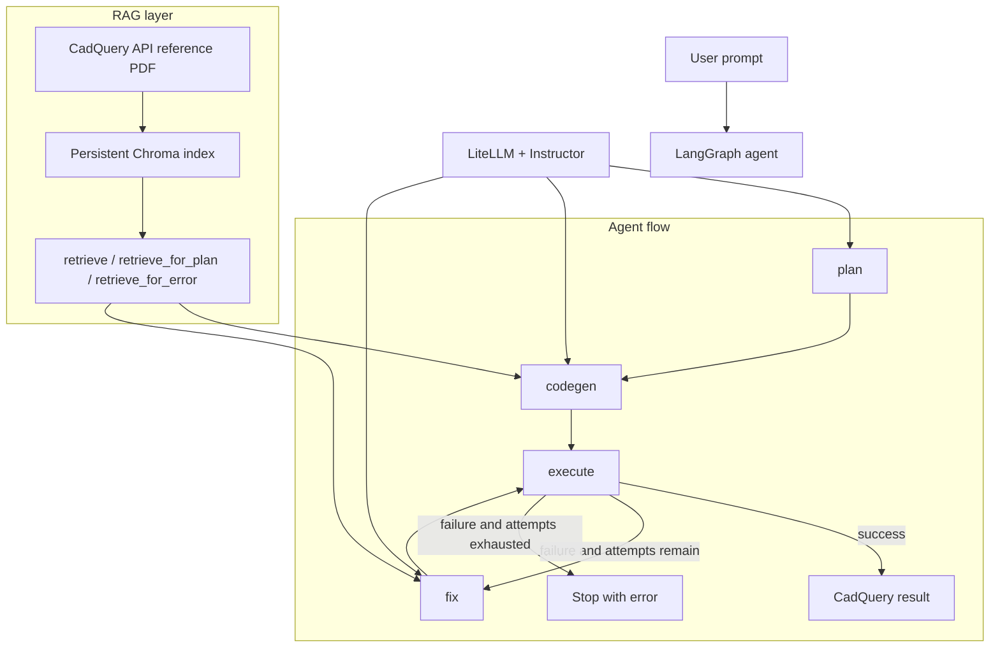

# Cad Generator

Cad Generator is a text-to-CAD workflow built around CadQuery, LangGraph, and retrieval-augmented generation. The repository has two branch shapes: `master` centers on the CLI agent, while `rest-api` is the current development branch that adds a FastAPI backend around the same core agent and is intended to be merged into main later.

The core behavior is simple in both branches: take a prompt, turn it into a geometric plan, generate CadQuery code from retrieved documentation, execute it, and persist the result or the failure state.

## What It Does

The project generates CadQuery models from plain English requests such as “make a small bracket with two mounting holes” or “build a tapered box with a lid.”

At a high level, it:

1. Accepts a user prompt from either the CLI or the API.
2. Builds a geometric plan for the model.
3. Retrieves CadQuery docs to ground code generation.
4. Executes the generated code in a constrained environment.
5. Diagnoses and retries when execution fails.
6. Exports successful runs as STL artifacts.

## How It Works

The shared agent is reused by both the CLI and the API branch.

- The LangGraph state machine plans the model, generates CadQuery code, executes it, and retries with a repair step when execution fails.
- The RAG layer builds a persistent Chroma index from the CadQuery API reference PDF and serves retrieval for planning and error repair.
- The executor runs generated code safely, checks that a `build()` function exists, and validates that the return value is a CadQuery `Shape` or `Workplane`.
- The prompt layer contains the templates used to generate plans, code, diagnoses, and repair code.
- The LLM wrapper calls LiteLLM and Instructor, including structured output for repair code.

The LangGraph loop works like this:

1. `plan` turns the user request into a CAD-oriented plan.
2. `codegen` retrieves relevant CadQuery docs and writes Python/CadQuery code.
3. `execute` runs the generated script.
4. If execution fails, `fix` diagnoses the error, retrieves more context, and regenerates code.
5. The loop stops when execution succeeds or the attempt limit is reached.

RAG is used twice:

- During code generation, to ground the model in CadQuery API usage.
- During error repair, to fetch docs relevant to the failure mode and the current code.

## LangGraph Diagram



## REST API

The `rest-api` branch adds a FastAPI backend on top of the shared agent. The application entrypoint is `backend/app/main.py`, which imports the API app from `backend/app/api` and runs it with Uvicorn.

Startup behavior:

- Loads environment variables from `.env` if present.
- Initializes the SQLAlchemy schema with `init_db()`.
- Builds or loads the CadQuery retriever on startup.
- Mounts a static `/artifacts` route for generated STL files.

Available API routes:

- `GET /health` returns a simple health check.
- `POST /users` creates a user.
- `GET /users/{user_id}` fetches a user.
- `POST /sessions` creates a session for a user.
- `GET /sessions/{session_id}` fetches session metadata.
- `GET /sessions/{session_id}/history` returns paginated request history.
- `DELETE /sessions/{session_id}` archives a session.
- `POST /sessions/{session_id}/archive` archives a session.
- `POST /sessions/{session_id}/unarchive` restores an archived session.
- `PATCH /sessions/{session_id}` updates the session title.
- `POST /sessions/{session_id}/generate-title` generates a title from the first request.
- `GET /sessions/user/{user_id}` lists active sessions for a user.
- `GET /sessions/user/{user_id}/archived` lists archived sessions for a user.
- `POST /sessions/{session_id}/request` submits a new prompt and queues execution.
- `GET /request/{request_id}` polls request status and, once complete, returns the stored result metadata.

Request execution flow:

1. A request is created with `queued` status.
2. FastAPI background tasks call the shared agent service.
3. The service streams LangGraph stage updates into the database.
4. On success, the CadQuery result is exported to STL and exposed through `/artifacts`.
5. On failure, the request stores the error, attempt count, and serialized agent state for later inspection.

The persistence layer uses SQLAlchemy models for `users`, `sessions`, and `requests`. Request records store the prompt, current stage, code, error payload, attempt count, result artifact URL, and a JSON snapshot of the agent state.

```mermaid
flowchart TD
    A[Client] -->|POST /sessions/{id}/request| R[FastAPI route]
    R --> Q[Create queued request]
    Q --> B[Background task]
    B --> H[Hydrate agent state]
    H --> G[Shared LangGraph agent]
    G --> S[Stream stage updates]
    S --> D[(SQLAlchemy / DB)]
    G --> E{Success?}
    E -->|yes| X[Export STL]
    X --> U[/artifacts/<request>.stl]
    E -->|no| F[Persist error + attempts]
    F --> D
    R --> P[GET /request/{request_id} polls status]
```

## CLI

The CLI remains available in `backend/app/cli.py` on the `rest-api` branch, and in `backend/src/main.py` on `master`. It loads the same agent graph and RAG layer, prompts for a 3D model request, and exports the resulting shape to `result.stl`. After each run, it can refine or improve the design by carrying forward the previous code and prompt history.

## Repo Layout

The layouts differ by branch, but the same README applies to both.

### master

```text
backend/
  data/
    cadquery_api_reference.txt
    cadquery-readthedocs-io-en-latest.pdf
  scripts/
    fetch_api_reference.py
  src/
    main.py
    agent/
      executor.py
      graph.py
      llm.py
      prompts.py
      rag.py
      state.py
  requirements.txt
```

### rest-api

```text
backend/
  app/
    api/
      requests.py
      sessions.py
      users.py
    agent/
      executor.py
      graph.py
      llm.py
      prompts.py
      rag.py
      state.py
    models/
    schemas/
    services/
    cli.py
    main.py
    db.py
  data/
    cadquery_api_reference.txt
    cadquery-readthedocs-io-en-latest.pdf
  scripts/
    fetch_api_reference.py
  requirements.txt
```

## Running It

The project is Python-based and expects the dependencies from `backend/requirements.txt`.

Typical setup:

1. Create and activate a Python environment.
2. Install dependencies from `backend/requirements.txt`.
3. Set `DATABASE_URL` if you are running the API branch and want persistence.
4. Set the LLM environment variables used by LiteLLM.
5. Run either the CLI or the FastAPI app.

Useful environment variables:

- `LLM_MODEL`: primary model name used by LiteLLM.
- `LLM_FALLBACKS`: optional comma-separated fallback models.
- `DATABASE_URL`: SQLAlchemy connection string for the API branch.
- `ARTIFACTS_DIR`: local directory where STL files are written.
- `ARTIFACTS_BASE_URL`: base URL used when returning artifact links.
- `.env`: loaded automatically if present.

The first API startup may build the retrieval index from the CadQuery PDF and persist it under `backend/data/chroma`.

## Future Scope

- Add a frontend for prompt input, iteration history, and model preview.
- Add BYOK support so users can bring their own LLM keys.
- Add proper authentication and authorization.
- Harden the REST API with rate limiting, user access controls, and deployment-ready configuration.
- Improve the planner so it produces more reliable geometric plans.
- Improve code generation quality and reduce repair loops.
- Add stronger validation around generated geometry and exported output.
- Add tests for the graph routing, retrieval behavior, API routes, and executor constraints.

## Notes

- The agent is intentionally constrained to `build()`-based CadQuery output.
- Generated code is executed against a restricted builtin set.
- RAG data is sourced from CadQuery documentation to reduce hallucinated API usage.
